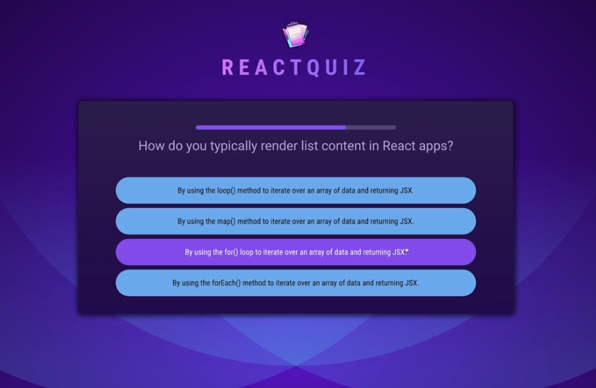

# ⚛️ React Quiz App

This is a dynamic, timed quiz application built with React and Vite. This project demonstrates advanced React state management and hook utilization to create a smooth, responsive, and bug-free user experience.



## Features

  * **Timed Questions:** Each question has a 10-second countdown timer.
  * **Automatic Skip:** If the timer runs out, the question is automatically skipped.
  * **Shuffled Answers:** Answer choices are shuffled for every new question to prevent pattern recognition.
  * **Instant Feedback:** The UI provides instant visual feedback for "correct" and "wrong" answers.
  * **Stateful Buttons:** Buttons are disabled after an answer is selected to prevent multiple submissions.
  * **Summary Screen:** A summary screen is displayed at the end of the quiz.

-----

## Technical Highlights & Key Concepts

This project goes beyond a simple React app and implements several advanced patterns for performance, stability, and bug prevention.

- Using the `key` prop on components (like the timer and answers) forces them to be completely re-created when the key changes, guaranteeing a fresh state for each new question.

- `useRef` is used to store the shuffled answer array, ensuring the answers are shuffled only once when the question first appears, not on every re-render.

- The `useEffect` hook includes a cleanup function to clear any running timers (`setTimeout`, `setInterval`) when a component is unmounted, preventing memory leaks and bugs.

- `useCallback` optimizes performance by preventing functions from being re-created on every render, which stops child components from re-rendering unnecessarily.
-----

## 🛠️ How to Run Locally

1.  **Clone the repository:**
    ```bash
    git clone https://github.com/AbdullahAbdelaziz122/react-quiz-app.git
    ```
2.  **Navigate to the project directory:**
    ```bash
    cd react-quiz-app
    ```
3.  **Install dependencies:**
    ```bash
    npm install
    ```
4.  **Run the development server:**
    ```bash
    npm run dev
    ```


## Tech Stack

  * **React:** UI library
  * **Vite:** Build tool and development server
  * **JavaScript (ES6+):** Core logic
  * **CSS:** Styling